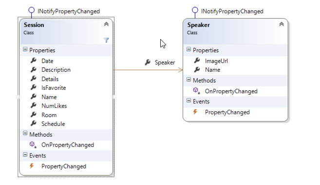
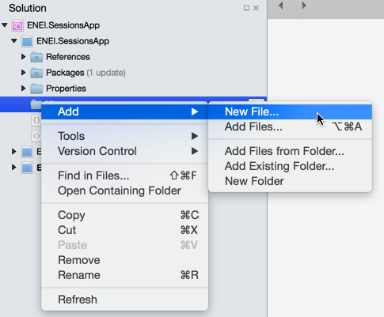

# 1010 ENEI || Xamarin Workshop


* [1010 ENEI || Xamarin Workshop](#1010-enei--xamarin-workshop)
* [Scope](#scope)
* [Requirements](#requirements)
* [Guides](#guides)
	1. [Create a Xamarin Forms project](#1--create-a-xamarin-forms-project)
	    * [Using Xamarin Studio in Mac](#using-xamarin-studio-in-mac)
		* [Using Xamarin Studio in Windows](#using-xamarin-studio-in-windows)
		* [Using Visual Studio in Windows](#using-visual-studio-in-windows)
		* [Running the application](#running-the-application)
		* [Additional notes - Xamarin Forms initialization ](#additional-notes---xamarin-forms-initialization)
	2. [Create the model and data source](#2-create-the-model-and-data-source)
	3. [Create the SessionsView](#3-create-the-sessionsview)
		* [Create the Xaml page](#create-the-xaml-page)
		* [Create the Header](#create-the-header)
			*[Defining the Images for each platform](#defining-the-images-for-each-platform)
		* [Create the Listview](#create-the-listview)
		* [Create the ItemTemplate](#create-the-itemtemplate)
		* [Create the menu for each Session](#create-the-menu-for-each-session)
			* [Running the application](#running-the-application-1)
	4. [Create the SessionDetailsView](#4-create-the-sessiondetailsview)
		* [Details Gesture](#the-details-gesture)
		* [Running the application](#running-the-application-2)
	5. [Add ShareService](#5-add-shareservice)
	    * [Windows Phone](#windows-phone)
		* [Android](#android)
		* [iOS](#ios)
	6. [Add splah screen, name and version](#6-add-splah-screen-name-and-version)
	7. [Add support for WinRT Apps](#7-add-support-for-winrt-apps)
* [Wrapping Up](#wrapping-up)
	 

## Scope
This workshop will be realized in [1010 ENEI](https://enei.pt/) at [University of Coimbra (Portugal)](http://www.uc.pt/en), March 28th 2015.

> The **Portuguese National Meeting of IT Students (ENEI)** is an annual event which main goal is to gather the national IT student community for a few days. 
ENEI was designed to allow access to new knowledge as well as to promote the sharing of experience, networking and fun activities. The 10th edition will take place this year (2015) in Coimbra, from the 27th to 30th of March.

In this [Xamarin Workshop](https://enei.pt/eventos/xamarin/), you will learn what's Xamarin and its products, how to create mobile cross-platform applications, using Xamarin, for Android, iOS and Windows. You will learn the two patterns most used in this kind of applications and at the end you will create your own 1010 ENEI Sessions App.

## Requirements
You should get your own Xamarin Student License for free in [xamarin.com/student](https://xamarin.com/student).




If you are portuguese, you can read the portuguese article in [Programar EMagazine](http://www.revista-programar.info/): ["Xamarin: Sem custos para estudantes"](http://www.revista-programar.info/artigos/xamarin-sem-custos-para-estudantes/).

Each student should:

* Have a Windows or a Mac device;
* Install [Xamarin Studio](http://xamarin.com/download);
* Install [Xamarin IOS](http://developer.xamarin.com/guides/ios/getting_started/installation/) and/or [Xamarin Android](http://developer.xamarin.com/guides/android/getting_started/installation/)
* Install [Xamarin Android Player](https://xamarin.com/android-player) or [Genymotion](https://www.genymotion.com/#!/)
* Install [Visual Studio Community 2013](https://www.visualstudio.com/en-us/news/vs2013-community-vs.aspx)
* Install [Windows Phone 8.1 SDK and Windows SDK for Windows 8.1](https://dev.windows.com/en-us/develop/downloads)


**Notes:**  

1. If you have a Windows device you can create Windows and Android applications. To create iOS applications is always required a Mac, and in this case you can create iOS and Android application using Xamarin Studio. With a Mac and Windows running in Parallels or VMware is possible to create the three targets at the same time (but is required a Windows Phone device to do the deploy!).
2. Xamarin Plugin for Visual Studio in only available for Business plan and for developers that participate in Open Source projects.


 
## Guides


### 1.	Create a Xamarin Forms project 

The application you will create is a Xamarin Forms application, based in Portable Class Library project. 


#### Using Xamarin Studio in Mac

Start by opening the Xamarin Studio as described in figure 1



**Figure 1: Xamarin Studio in a Mac**

Then create a new Blank App (Xamarin Forms Portable), as following:




**Figure 2: Creating a Blank App (Xamarin Forms Portable)**


Which result will be something as described in Figure 3:




**Figure 3:  The ENEI.SessionsApp solution**


The ENEI.SessionApp solution is defined by three projects:


* **ENEI.SessionsApp:** portable class library project, which will contain the shared code between targets. This project is independent of the platform;
* **ENEI.SessionsApp.Droid:** Xamarin Android project, which define the Android application and knows the Android API;
* **ENEI.SessionsApp.iOS:** Xamarin iOS project, which define the iOS application and knows the iOS API;

Now, you should update the [NuGet Packages](https://www.nuget.org/) available in project. In the case described in figure 4, you only need to update the [Xamarin Forms NuGet Package](https://www.nuget.org/packages/Xamarin.Forms):



**Figure 4: Xamarin Forms Nuget package to update in iOS application**


To update this package you only need to open the context menu, doing a right click with the mouse and then click “Update”, as described in Figure 5:



**Figure 5: Updating NuGet packages**


The result will be



**Figure 6: iOS project updated**

You need to do the same in the others projects, if needed.
Before run the application, you should select the solution and define the configurations, as following:



**Figure 7: Configuration Properties**

Wowwww, now you are ready to create your 1010 ENEI Session app! 

#### Using Xamarin Studio in Windows

Start by opening the Xamarin Studio as described in figure 8:



**Figure 8: Xamarin Studio in Windows**


Then create a new Blank App (Xamarin Forms Portable), as described in the following figure:



**Figure 9: Creating a Blank App (Xamarin Forms Portable)**


The result will be something as described in figure 10:



**Figure 10:  The ENEI.SessionsApp solution**


The ENEI.SessionApp solution is defined by two projects:

* **ENEI.SessionsApp:** portable class library project, which will contain the shared code between targets. This project is independent of the platform;
* **ENEI.SessionsApp.Droid:** Xamarin Android project, which define the Android application and knows the Android API;

Now, you should update the [NuGet Packages](https://www.nuget.org/) available in the project. In the case described in figure 11, you only need to update the [Xamarin Forms NuGet Package](https://www.nuget.org/packages/Xamarin.Forms) and the [Xamarin.Android.Support.v4 NuGet Package](https://www.nuget.org/packages/Xamarin.Android.Support.v4/):



**Figure 11: Nuget packages to update in Android application**

To update this package you only need to open the context menu, doing a right click with the mouse and then click “Update”, as described in figure 12:



**Figure 12: Updating Nuget packages**

The result will be



**Figure 13: Android project updated**


You need to do the same in the other project, if needed.
Wowwww, now you are ready to create your 1010 ENEI Session app! 

##### Using Visual Studio in Windows

Start by opening the Visual Studio as described in figure 14
 



**Figure 14: Visual Studio 2013**

And then create a new Blank App (Xamarin Forms Portable), as following:



**Figure 15: Creating a Blank App (Xamarin Forms Portable)**


Which result will be something as described in figure 16:


**Figure 16:  The ENEI.SessionsApp solution**


The ENEI.SessionApp solution is defined by four projects:

* **ENEI.SessionsApp:** portable class library project, which will contain the shared code between targets. This project is independent of the platform;
* **ENEI.SessionsApp.Droid:** Xamarin Android project, which define the Android application and knows the Android API;
* **ENEI.SessionsApp.iOS:** Xamarin iOS project, which define the iOS application and knows the iOS API;
* **ENEI.SessionsApp.WinPhone:** Windows Phone project, which define the Windows Phone application and knows the Windows Phone API;

Now, you should update the [Nuget Packages](https://www.nuget.org/) available in the project. This case you only need to update the [Xamarin Forms Nuget Package](https://www.nuget.org/packages/Xamarin.Forms), as described in figure 17 and figure 18:



**Figure 17: Opening the “Manage NuGet Package” window**



**Figure 18: Nuget Package Manager**

The result will be



**Figure 19: Xamarin Forms NuGet package updated**

You need to do the same in the others project, if needed.

Before run the application, you should select the solution and define the build and deploy apps, as following:



**Figure 20: Configuration Properties**

Wowwww you ready to create your 1010 ENEI app! 

#### Running the application

Depending the scenario you are, you will have more or less platforms covered, here is an overview:

* **Using Xamarin Studio in a Mac:** Android + iOS Apps
* **Using Xamarin Studio in Windows:** Android Apps
* **Using Visual Studio without Xamarin plugin:**  Windows Apps
* **Using Visual Studio with Xamarin plugin:** Windows, Android and iOS (*) apps.


(*) Is required a Xamarin Build Host in a Mac connect to Visual Studio.


In figure 21, is possible to see the Android, iOS and Windows Phone applications running at the same time. The Android app is running in Xamarin Android Player, iOS app is running in IPhone Simulator and Windows Phone application is running in a Lumia 1020 device (which is connect to a Windows running in a Parallels, in a Mac).



**Figure 21: Android, iOS and Windows Phone applications running at same time**



#### Additional notes - Xamarin Forms initialization 

Each developer should understand how Xamarin Forms app is defined. This way, developers should know:
In ENEI.SessionsApp.iOS app, more specific in AppDelegate.cs has the following code:

     public override bool FinishedLaunching(UIApplication app, NSDictionary options)
     {
            global::Xamarin.Forms.Forms.Init();
            LoadApplication(new App());

            return base.FinishedLaunching(app, options);
    }


Which initialize the Xamarin Forms and define which class has the start point for the Xamarin Forms App that defines the main page created with the Xamarin Forms API.
The same happens in ENEI.Sessions.Android app, more specific in MainActivity.cs:

    protected override void OnCreate(Bundle bundle)
    {
            base.OnCreate(bundle);

            global::Xamarin.Forms.Forms.Init(this, bundle);
            LoadApplication(new App());
    }


And in ENEI.Sessions.WinPhone app, more specific in MainPage.xaml.cs

      public MainPage()
      {
            InitializeComponent();
            SupportedOrientations = SupportedPageOrientation.PortraitOrLandscape;

            global::Xamarin.Forms.Forms.Init();
            LoadApplication(new ENEI.SessionsApp.App());
     }


At this moment, the App.cs defined in ENEI.SessionsApp (portable class library) is defined by

    public class App : Application
    {
        public App()
        {
            // The root page of your application
            MainPage = new ContentPage
            {
                Content = new StackLayout
                {
                    VerticalOptions = LayoutOptions.Center,
                    Children = {
						new Label {
							XAlign = TextAlignment.Center,
							Text = "Welcome to Xamarin Forms!"
						}
					}
                }
            };
        }
     …




As mentioned early, the ENEI.SessionsApp will be the project, which will have the shared code between targets and it is independent of the platform. This way, in this project you will define the Model, the Views, the data source and other useful class that can be reused between platforms.

### 2. Create the model and data source

#### The model

Before create the UI, you need to define the model, for it you will define:

* **Session:** class that define a session from 1010 ENEI event
* **Speaker:** class that define a speaker

Each session should have a speaker (In real scenarios can have more than one!). Figure 22 define the class diagram from the model:



**Figure 22: The model**


In ENEI.SessionsApp project create the Session and the Speaker class in a “Model” folder, as described in figures 23 and 24:



**Figure 23: Creating new Folder**




**Figure 24: Adding new file**


The Session class can be defined by:

    public class Session : INotifyPropertyChanged
    {
        private int _numLikes;
        private Speaker _speaker;
        private string _date;
        private string _description;
        private string _name;
        private bool _isFavorite;
        private string _schedule;
        private string _room;

        public string Name
        {
            get { return _name; }
            set { _name = value; OnPropertyChanged(); }
        }

        public string Description
        {
            get { return _description; }
            set { _description = value; OnPropertyChanged(); }
        }

        public string Date
        {
            get { return _date; }
            set { _date = value; OnPropertyChanged(); }
        }

        public int NumLikes
        {
            get { return _numLikes; }
            set { _numLikes = value; OnPropertyChanged();}
        }

        public Speaker Speaker
        {
            get { return _speaker; }
            set { _speaker = value; OnPropertyChanged(); }
        }

        public bool IsFavorite
        {
            get { return _isFavorite; }
            set { _isFavorite = value; OnPropertyChanged();}
        }

        public string Schedule
        {
            get { return _schedule; }
            set { _schedule = value; OnPropertyChanged(); }
        }

        public string Room
        {
            get { return _room; }
            set { _room = value; OnPropertyChanged(); }
        }

        public string Details
        {
            get { return string.Format("{0} | {1} | Sala {2} ", Date, Schedule, Room); }
        }

        public event PropertyChangedEventHandler PropertyChanged;
        
        protected virtual void OnPropertyChanged([CallerMemberName] string propertyName = null)
        {
            var handler = PropertyChanged;
            if (handler != null) handler(this, new PropertyChangedEventArgs(propertyName));
        }
    }


And the Speaker class can be defined by:
         

    public class Speaker : INotifyPropertyChanged
    {
        private string _name;
        private string _imageUrl;

        public string Name
        {
            get { return _name; }
            set { _name = value; OnPropertyChanged();}
        }

        public string ImageUrl
        {
            get { return _imageUrl; }
            set { _imageUrl = value; OnPropertyChanged(); }
        }

        public event PropertyChangedEventHandler PropertyChanged;

        protected virtual void OnPropertyChanged([CallerMemberName] string propertyName = null)
        {
            var handler = PropertyChanged;
            if (handler != null) handler(this, new PropertyChangedEventArgs(propertyName));
        }
    }


> Both class implements the interface **INotifyPropertyChangedv**, which allow notify the UI about changes in model and this way the data will be update in UI (only when is binding the model with the UI!).

#### The data source

The data source will define the data that will be loaded by the application, at this moment you will have hard code data, but in real scenarios you should have a file, database or services to provide it.
Get the »»SessionsDataSource class»» here, or create your own data.


### 3. Create the SessionsView

In this step, you will create the user interface to the SessionsView (which is the main page) to show the data defined in the last step.

#### Create the Xaml page

In Xamarin Studio, select the ENEI.SessionsApp project and create a folder called “Views”, as described in figure 25 and figure 26:



**Figure 25: Creating new folder**



**Figure 26: The Views folder in the project**


Then select the folder “Views” , do a double click with the mouse to open the context and the click in “Add”> “New File...” as described in figure 27:



**Figure 27: Add new file**

Select “Forms ContentPage Xaml”, as following:



**Figure 28: Adding a Xaml page**


The result will be something as following:



**Figure 29: The xaml page code**


The SessionsView xaml is defined by:

* The **xaml** file which define the user interface 
* The **cs** file which define the code behind 

> This approach is really useful when designers and developers work together, and using MVVM pattern it allow to have UI separated from the behavior of the page.


> See more about Xaml in this article [Xamarin.Forms Xaml Basics](http://developer.xamarin.com/guides/cross-platform/xamarin-forms/xaml-for-xamarin-forms/). 



Now let’s change the App.cs in ENEI.SessionsApp to use the SessionsView:

    public class App : Application
    {
        public App()
        {
            // The root page of your application
            MainPage = new NavigationPage(new SessionsView())
            {
                BarBackgroundColor = Color.White,
                BarTextColor = Color.Black
            };
        }


In this case, you defined the MainPage with a NavigationPage which content is defined by SessionView. The NavigationPage is required when the application required navigation between page and the application should have only one NavigationPage.
At this moment, if you run the application you will not have content and you should have something like as described in figure 30:


**Figure 30: The xaml page code**

Now let’s define the UI…

#### Create the Header

The first thing you should define is the Title and the Icon used in the title, this mean we will define the header of the page, something like as following:



**Figure 31: The header**


Defining the following code:

     <ContentPage xmlns="http://xamarin.com/schemas/2014/forms"
             xmlns:x="http://schemas.microsoft.com/winfx/2009/xaml"
             x:Class="ENEI.SessionsApp.Views.SessionsView"
             Title="1010 ENEI || Sessões"
             BackgroundColor="White"
             Icon="ic_action_users.png">


You will create the header but only for Android and iOS (which not show icon). This way to create the header for Windows Phone we need to create a workaround, as we will see below.
The **SessionsView** is a **ContentPage** which is a simple page provided by [Xamarin Forms API](http://api.xamarin.com/?link=N%3aXamarin.Forms) (see more in [Xamarin Forms Gallery](http://developer.xamarin.com/guides/cross-platform/xamarin-forms/controls/pages/)). To define its content, you should use [controls layouts](http://developer.xamarin.com/guides/cross-platform/xamarin-forms/controls/layouts/) like StackLayout or Grid, for example.



**Figure 32: Control Layouts**


This way, let’s choose the Grid as control layout to define two rows and one columns, where:

* The first row has the header for Windows Phone (hidden to the others platforms)
* The second row has the ListView to show the sessions. 

The code for it will be something like as following:

        <?xml version="1.0" encoding="utf-8" ?>
        <ContentPage xmlns="http://xamarin.com/schemas/2014/forms"
             xmlns:x="http://schemas.microsoft.com/winfx/2009/xaml"
             x:Class="ENEI.SessionsApp.Views.SessionsView"
             Title="1010 ENEI || Sessões"
             BackgroundColor="White"
             Icon="ic_action_users.png">
           <Grid BackgroundColor="White">
             <Grid.RowDefinitions>
               <RowDefinition Height="Auto" />
               <RowDefinition Height="*" />
             </Grid.RowDefinitions>
           <!-- Title - Only for WP-->
           <StackLayout Grid.Row="0" Orientation="Horizontal" Padding="20,10,0,0">
           <StackLayout.IsVisible>
              <OnPlatform Android="false"
                    WinPhone="true"
                    iOS="false"
                    x:TypeArguments="x:Boolean" />
           </StackLayout.IsVisible>
           <Image WidthRequest="48" 
             HeightRequest="38" 
             Source="Images/ic_action_users.png"/>
           <Label FontSize="Large" FontAttributes="Bold"
                  TextColor="Black">
           <OnPlatform Android=""
                    WinPhone="1010 ENEI || Sessões"
                    iOS=""
                    x:TypeArguments="x:String" />
            </Label>
           </StackLayout>
           <!-- ListView will be defined here -->
          </Grid>
        </ContentPage>


##### Defining the Images for each platform

In the last step you used the image “ic_action_users.png” which need to be add to each project (ENEI.SessionApp.Android, ENEI.SessionApp.iOS and ENEI.SessionApp.WinPhone). This way, each app will have its own images, which should be defined following the platform specifications, i.e., each image should provide the right resolution by platform.
Get the images & assets by platform »»here»», and see more about this subject in this [article](http://developer.xamarin.com/guides/cross-platform/xamarin-forms/working-with/images/).


At this moment, you should have


 
**Figure 33: The Windows Phone, iOS and Android applications**

#### Create the Listview

The next step is to define the list of the session from the 1010 ENEI, which were defined in the topic “The Data Source”. 
To show the list of the session you will use a ListView which must have:

* **ItemsSource** defined with the list of sessions
* **ItemTemplate** defined with the template for each row 

Let’s define the first version of the ListView as following:

    <!-- ListView will be defined here -->
    <ListView x:Name="SessionsList"
                 Grid.Row="1"
                 ItemSelected="SessionsList_OnItemSelected"
                 ItemsSource="{Binding Sessions}"
                 SeparatorColor="#0094FF">
      <!--
                Setting the HasUnevenRows property tells the list view to render
                each cell with a different height.
            -->
      <ListView.RowHeight>
        <OnPlatform Android="150"
                    WinPhone="180"
                    iOS="150"
                    x:TypeArguments="x:Int32" />
      </ListView.RowHeight>
    </ListView>
  

The Listview has the name “SessionsList”, which is defined in the second row of the grid which define the root content of the page, it has the “ItemSelected” subscribed to ignore the “SelectItem”, the “SeparatorColor" is defined as blue and the “ItemsSource” is binding with the “Sessions” property (which is a property from the object defined in “BindingContext”.

> Data bindings allow properties of two objects to be linked so that a change in one causes a change in the other. See more about it in these article [Data Binding Basics](http://developer.xamarin.com/guides/cross-platform/xamarin-forms/xaml-for-xamarin-forms/data_binding_basics/) and [From Data Bindings to MVVM](http://developer.xamarin.com/guides/cross-platform/xamarin-forms/xaml-for-xamarin-forms/data_bindings_to_MVVM/).


Each row from the ListView can be defined with static or dynamic size. In this case was defined a static size for each platform (related with screen resolution). A developer that needs to have different row’s size depending the data showed is recommended to use the property HasUnevenRows.


To complete, in code behind, you need to define the Sessions that should be an “ObservableCollection” of Session (this kind of list allow to notify the UI each time an object is removed or added in the list).  You need to get the sessions from the “SessionsDataSource” and you need to define the “BindingContext”. The data should be loaded in the “OnAppearing” method and is not recommended to load it in the constructor of the page, because it will increase the time required to create the page which can create issues.

    public partial class SessionsView : ContentPage
    {
        public SessionsView()
        {
            InitializeComponent();
            Sessions = new ObservableCollection<Session>();
            BindingContext = this;

        }

        public ObservableCollection<Session> Sessions { get; set; }

        protected override void OnAppearing()
        {
            base.OnAppearing();
            if (Sessions.Count == 0)
            {
                var sessions = SessionsDataSource.GetSessions();
                foreach (var session in sessions)
                {
                    Sessions.Add(session);
                }
            }
        }
        private void SessionsList_OnItemSelected(object sender, SelectedItemChangedEventArgs e)
        {
            if (SessionsList.SelectedItem == null)
            {
                return;
            }

            SessionsList.SelectedItem = null;
        }
    }

 
> In this case, you will not use MVVM pattern, which is extremely recommended in real projects. To keep it simple the code behind will have the behavior used by UI that in a MVVM pattern is defined in the ViewModel.


#### Create the ItemTemplate

The Listview has the “ItemTemplate” property that allows defining a “DataTemplate” for each row. In this case you will define a template as described in figure 34, which code will be:

     <ListView.ItemTemplate>
         <DataTemplate>
                    <ViewCell>
                        <ViewCell.View>
                            <Grid BackgroundColor="Transparent" Padding="20,0,20,0">
                                <Grid.ColumnDefinitions>
                                    <ColumnDefinition Width="Auto" />
                                    <ColumnDefinition Width="*" />
                                </Grid.ColumnDefinitions>
                                <Grid.RowDefinitions>
                                    <RowDefinition Height="5" />
                                    <RowDefinition Height="Auto" />
                                    <RowDefinition Height="48" />
                                    <RowDefinition Height="5" />
                                </Grid.RowDefinitions>
                                <!-- Define the Image from Speaker -->
                                <Image Grid.Row="1"
                                       HorizontalOptions="StartAndExpand"
                                       Source="{Binding Speaker.ImageUrl}"
                                       VerticalOptions="Start">
                                    <Image.WidthRequest>
                                        <OnPlatform Android="50"
                                                    WinPhone="100"  iOS="50"
                                                    x:TypeArguments="x:Double" />
                                    </Image.WidthRequest>
                                    <Image.HeightRequest>
                                        <OnPlatform Android="50"
                                                    WinPhone="100" iOS="50"
                                                    x:TypeArguments="x:Double" />
                                    </Image.HeightRequest>
                                </Image>
                                <!-- Define the Image from Speaker -->
                                <StackLayout Grid.Row="1"
                                             Grid.Column="1"
                                             HorizontalOptions="FillAndExpand"
                                             Padding="10,0,0,0">
                                    <Label Font="Medium"
                                           FontAttributes="Bold"
                                           Text="{Binding Name}"
                                           TextColor="Black" />
                                    <Label Font="Medium"
                                           LineBreakMode="TailTruncation"
                                           Text="{Binding Speaker.Name}"
                                           TextColor="Black" />
                                    <Label Font="Small"
                                           LineBreakMode="TailTruncation"
                                           TextColor="Black" Text="{Binding Details}"/>
                                </StackLayout>               
                                <!-- Define the menu for each session -->  
                           </Grid>
                       </ViewCell.View>
                    </ViewCell>
                </DataTemplate>
      </ListView.ItemTemplate>




**Figure 34: A row in listview**


Running the application you will have the following:




**Figure 35: The Windows Phone, iOS and Android application showing sessions from 1010 ENEI**

#### Create the menu for each Session

To create the menu for each session as described in figure 36, you need to change the ItemTemplate defined above:



**Figure 36: The session’s menu**
The implementation can be something as following:


    <Grid Grid.Row="2" Grid.Column="0"  Grid.ColumnSpan="2" Padding="0,5,0,0">
                  <Grid.ColumnDefinitions>
                    <ColumnDefinition Width="*" /> <ColumnDefinition Width="Auto" />
                    <ColumnDefinition Width="*" /> <ColumnDefinition Width="Auto" /><ColumnDefinition Width="*" />
                    <ColumnDefinition Width="Auto" /> <ColumnDefinition Width="*" /><ColumnDefinition Width="Auto" />
                    <ColumnDefinition Width="*" />
                  </Grid.ColumnDefinitions>
                  <StackLayout Grid.Column="1" Orientation="Horizontal">
                    <Image>
                      <Image.WidthRequest>
                        <OnPlatform Android="48" WinPhone="48" iOS="30"  x:TypeArguments="x:Double" />
                      </Image.WidthRequest>
                      <Image.HeightRequest>
                        <OnPlatform Android="48"  WinPhone="48" iOS="30" x:TypeArguments="x:Double" />
                      </Image.HeightRequest>
                      <Image.Source>
                        <OnPlatform x:TypeArguments="ImageSource">
                          <OnPlatform.iOS>  <FileImageSource File="ic_action_like.png" />
                          </OnPlatform.iOS>
                          <OnPlatform.Android> <FileImageSource File="ic_action_like.png" />
                          </OnPlatform.Android>
                          <OnPlatform.WinPhone><FileImageSource File="Images/ic_action_like.png" />
                          </OnPlatform.WinPhone>
                        </OnPlatform>
                      </Image.Source>
                    </Image>
                    <Label Font="Small" Text="{Binding NumLikes}" TextColor="#0094FF" VerticalOptions="Center" />
                  </StackLayout>
                  <Image Grid.Column="3" Source="{Binding IsFavorite, Converter={StaticResource FavoriteImageConverter}}">
                    <Image.WidthRequest>
                      <OnPlatform Android="48" WinPhone="48" iOS="30"  x:TypeArguments="x:Double" />
                    </Image.WidthRequest>
                    <Image.HeightRequest>
                      <OnPlatform Android="48"  WinPhone="48"    iOS="30"  x:TypeArguments="x:Double" />
                    </Image.HeightRequest>
                  </Image>
                  <Image Grid.Column="5">
                    <Image.WidthRequest>
                      <OnPlatform Android="30"  WinPhone="48" iOS="30" x:TypeArguments="x:Double" />
                    </Image.WidthRequest>
                    <Image.HeightRequest>
                      <OnPlatform Android="30"  WinPhone="48" iOS="30" x:TypeArguments="x:Double" />
                    </Image.HeightRequest>
                    <Image.Source>
                      <OnPlatform x:TypeArguments="ImageSource">
                        <OnPlatform.iOS><FileImageSource File="ic_action_share_2.png" /></OnPlatform.iOS>
                        <OnPlatform.Android><FileImageSource File="ic_action_share_2.png" /></OnPlatform.Android>
                        <OnPlatform.WinPhone>
      <FileImageSource File="Images/ic_action_share_2.png" /></OnPlatform.WinPhone>
                      </OnPlatform> </Image.Source>  </Image>
                  <Image Grid.Column="7">
                    <Image.WidthRequest>
                      <OnPlatform Android="30" WinPhone="48" iOS="30"   x:TypeArguments="x:Double" />
                    </Image.WidthRequest>
                    <Image.HeightRequest>
                      <OnPlatform Android="30"   WinPhone="48"  iOS="30" x:TypeArguments="x:Double" />
                    </Image.HeightRequest>
                    <Image.Source>
                      <OnPlatform x:TypeArguments="ImageSource">
                        <OnPlatform.iOS>   <FileImageSource File="ic_action_list.png" />
                        </OnPlatform.iOS>
                        <OnPlatform.Android><FileImageSource File="ic_action_list.png" />
                        </OnPlatform.Android>
                        <OnPlatform.WinPhone> <FileImageSource File="Images/ic_action_list.png" />
                        </OnPlatform.WinPhone>
                      </OnPlatform>
                    </Image.Source>
                  </Image>
                </Grid>
         



> The SessionDetailsView will have a similar implementation for the header as defined in SessionsView, the difference it is the title value, which will be defined by the Session’s name.


The code above contains a grid with four images: Like, Favorite, Share and Details. And for each one we need to subscribe the Tap event using the “GestureRecognizers” from the Image, this way you need to define for each image its TapGesture as following:

     <Image.GestureRecognizers>
     <TapGestureRecognizer x:Name="FavoriteGesture"
                 CommandParameter="{Binding}" Tapped="FavoriteGestureRecognizer_OnTapped" />
    </Image.GestureRecognizers>


Where the event’s handler will be defined as following:

      private void FavoriteGestureRecognizer_OnTapped(object sender, EventArgs e)
        {
            var tappedEventArg = e as TappedEventArgs;
            if (tappedEventArg != null)
            {
                var session = tappedEventArg.Parameter as Session;
                if (session != null)
                {
                    session.IsFavorite = !session.IsFavorite;
                }
            }
        }


Do the same for “Like” and for Share and Details we will see it in next steps.

##### Running the application

At this moment you should have the UI from the 1010 ENEI Sessions App as described in figure 37:



**Figure 37: The Windows Phone, iOS and Android applications**



### 4. Create the SessionDetailsView

In the last step, you created the menu for each Session and it was created the “Details” option, which has the goal to show the details from a selected session. 

Let’s create the SessionDetailsView!

Create a new Xaml page, like it you did to create the SessionsView page. Then open the SessionDetailsView and you should have something as following:


Then create the content, as following:

    <?xml version="1.0" encoding="utf-8" ?>
    <ContentPage x:Class="ENEI.SessionsApp.View.SessionDetailsView"
             xmlns="http://xamarin.com/schemas/2014/forms"
             xmlns:x="http://schemas.microsoft.com/winfx/2009/xaml"
             BackgroundColor="White"    Icon="ic_action_users.png">
    <StackLayout BackgroundColor="White" Spacing="20">
      <StackLayout Orientation="Horizontal" Padding="20,10,0,0">
        <StackLayout.IsVisible>
          <OnPlatform Android="false"
                      WinPhone="true" iOS="false”   x:TypeArguments="x:Boolean" />
        </StackLayout.IsVisible>
        <Image WidthRequest="48" HeightRequest="38" Source="Images/ic_action_users.png"/>
        <Label FontSize="Large" FontAttributes="Bold" Text="{Binding Name}"
             TextColor="Black"/>
      </StackLayout>
      <StackLayout Orientation="Horizontal" Padding="20,20,20,0" Spacing="20">
            <Image HorizontalOptions="Start"
                   Source="{Binding Speaker.ImageUrl}"
                   VerticalOptions="Start">
                <Image.WidthRequest>
                    <OnPlatform Android="50" WinPhone="200" iOS="50"
                                x:TypeArguments="x:Double" />
                </Image.WidthRequest>
                <Image.HeightRequest>
                    <OnPlatform Android="50" WinPhone="200"    iOS="50"
                                x:TypeArguments="x:Double" />
                </Image.HeightRequest>
            </Image>
            <StackLayout HorizontalOptions="Start" Padding="10,0,0,0">
                <Label Font="Large"
                       HorizontalOptions="Start"
                       LineBreakMode="WordWrap"
                       Text="{Binding Speaker.Name}"
                       TextColor="Black" />
                <Label Font="Small"
                       HorizontalOptions="Start"
                       LineBreakMode="TailTruncation"
                       Text="{Binding Date}"
                       TextColor="Black" />
            </StackLayout>
        </StackLayout>

      <ScrollView VerticalOptions="FillAndExpand"  Padding="20,20,20,0">
            <Label Font="Medium"
                   HorizontalOptions="Start"
                   LineBreakMode="WordWrap"
                   Text="{Binding Description}"
                   TextColor="Black" />
        </ScrollView>
    </StackLayout>
    </ContentPage>


And in code behind define the BindingContext and the Title, as following: 

    public partial class SessionDetailsView : ContentPage
    {
        private readonly Session _session;

        public SessionDetailsView(Session session)
        {
            _session = session;
            InitializeComponent();
            Title = session.Name;
            BindingContext = session;
        }
    }


This page will have the BindingContext defined with session object, but could be the page as in SessionsView.

#### The Details gesture

Now that you have the new page created, you need to connect the both pages and it is possible through the “Detail” option for each session in Listview. This way, in the SessionsView we need to use the details gesture to navigate from the SessionsView to the SessionDetailsView, sending the selected session. The implementation can be something as following:

       private void DetailsGesture_OnTapped(object sender, EventArgs e)
        {
            var tappedEventArg = e as TappedEventArgs;
            if (tappedEventArg != null)
            {
                var session = tappedEventArg.Parameter as Session;
                if (session != null)
                {
                    Navigation.PushAsync(new SessionDetailsView(session), true);
                }
            }
        }


#### Running the application

At this moment, you should navigate to the Session details view, which result should be as described in figure 38:



**Figure 38: The Windows Phone, iOS and Android applications**

> The navigation from SessionDetailsView is made using the back button provided in iOS and Android pages and by physical back button from Windows Phone, which do not require implementation.



### 5. Add ShareService

An application which allow to share content in social networks brings more value to the users, because allow to share with others something the user think is important or relevant. An application for events like 1010 ENEI Sessions App could not miss this feature.


Each platform has your own implementation to share content in social network. This means, we need to create an abstraction of the share feature to use it in ENEI.SessionsApp and then in each platform we need to implement that abstraction.
Let’s see how the Abstraction Pattern can be created!
In ENEI.SessionsApp project, create the interface IShareService as following:

    public interface IShareService
    {
        void ShareLink(string title, string status, string link);
    }
  

Then is required to create the implementation of the IShareService in each platform. Let’s define the following implementation by platform:

#### Windows Phone

	[assembly: Dependency(typeof(ShareService))]
    namespace ENEI.SessionsApp.WinPhone.Services
    {
        public class ShareService : IShareService
        {
          public void ShareLink(string title, string status, string link)
          {
            var task = new ShareLinkTask { Title = title, Message = status, LinkUri = new Uri(link) };
            Device.BeginInvokeOnMainThread(() =>
            {
                try
                {
                    task.Show();
                }
                catch (Exception ex)
                {
                 // todo handle the error   
                }
            });
        }
      }
    }



#### Android

     

     [assembly: Dependency(typeof(ShareService))]
     namespace ENEI.SessionsApp.Droid.Services
     {
       public class ShareService : IShareService
       {
         public void ShareLink(string title, string status, string link)
         {
            var intent = new Intent(global::Android.Content.Intent.ActionSend);
            intent.PutExtra(global::Android.Content.Intent.ExtraText, string.Format("{0} - {1}", status ?? string.Empty, link ?? string.Empty));
            intent.PutExtra(global::Android.Content.Intent.ExtraSubject, title ?? string.Empty);
            intent.SetType("text/plain");
            intent.SetFlags(ActivityFlags.ClearTop);
            intent.SetFlags(ActivityFlags.NewTask);
            Android.App.Application.Context.StartActivity(intent);
        }
      }
    }


#### iOS
	

	[assembly: Dependency(typeof(ShareService))]
    namespace ENEI.SessionsApp.iOS.Services
    {
    public class ShareService : IShareService
    {
        public void ShareLink(string title, string status, string link)
        {
            var actionSheet = new UIActionSheet("Share on");
            foreach (SLServiceKind service in Enum.GetValues(typeof(SLServiceKind)))
            {
                actionSheet.AddButton(service.ToString());
            }
            actionSheet.Clicked += delegate(object a, UIButtonEventArgs b)
            {
                SLServiceKind serviceKind = (SLServiceKind)Enum.Parse(typeof(SLServiceKind), actionSheet.ButtonTitle(b.ButtonIndex));
                ShareOnService(serviceKind, title, status, link);
            };
            actionSheet.ShowInView(UIApplication.SharedApplication.KeyWindow.RootViewController.View);
        }

        private void ShareOnService(SLServiceKind service, string title, string status, string link)
        {
            if (SLComposeViewController.IsAvailable(service))
            {
                var slComposer = SLComposeViewController.FromService(service);
                slComposer.SetInitialText(status);
                slComposer.SetInitialText(title != null ? string.Format("{0} {1}", title, status) : status);
                if (link != null)
                {
                    slComposer.AddUrl(new NSUrl(link));
                }
                slComposer.CompletionHandler += (result) =>
                {
                    UIApplication.SharedApplication.KeyWindow.RootViewController.InvokeOnMainThread(() =>
                    {
                        UIApplication.SharedApplication.KeyWindow.RootViewController.DismissViewController(true, null);
                    });
                };
                UIApplication.SharedApplication.KeyWindow.RootViewController.PresentViewController(slComposer, true, null);
            }
        }
      }
    }



This way, we are ready to call the share service in the SessionsView using DependencyService, as following:

	private void ShareGesture_OnTapped(object sender, EventArgs e)
        {
            var tappedEventArg = e as TappedEventArgs;
            if (tappedEventArg != null)
            {
                var session = tappedEventArg.Parameter as Session;
                if (session != null)
                {
                    var shareService = DependencyService.Get<IShareService>();
                    if (shareService != null)
                    {
                        var status = string.Format("Não percas a sessão {0} de {1}.", session.Name, session.Speaker.Name);
                        shareService.ShareLink("ENEI 2015", status, "https://enei.pt/");
                    }
                }
            }
        }



> The **DependencyService** only will get the implementation from the **IShareService** because the implementation from each platform was registered using:
**[assembly: Dependency(typeof(ShareService))]**


At this moment the 1010 ENEI Sessions App has support to share session in social network!


### 6. Add splah screen, name and version


#### Define the splash screen

:warning: In progress

#### Define the name and the version for each platform

:warning: In progress

### 7. Add support for WinRT Apps
:warning: In progress

## Wrapping Up

Xamarin Forms allow us to quickly create native applications for the different platforms with the same code base. This way, it will reduce the maintenance time and increases the time to improve the application.



**Figure 39: The Android application**


**Figure 40: The iOS application**


**Figure 41: The Windows Phone application**


**Figure 42: The Windows Phone, iOS and Android applications**
