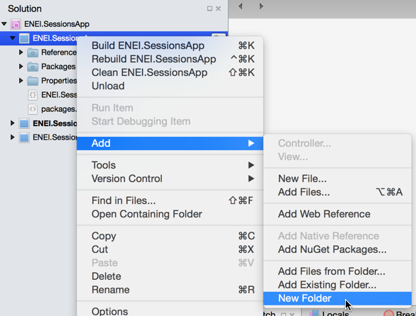
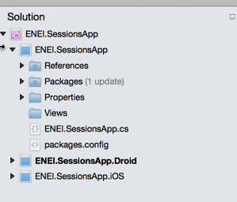
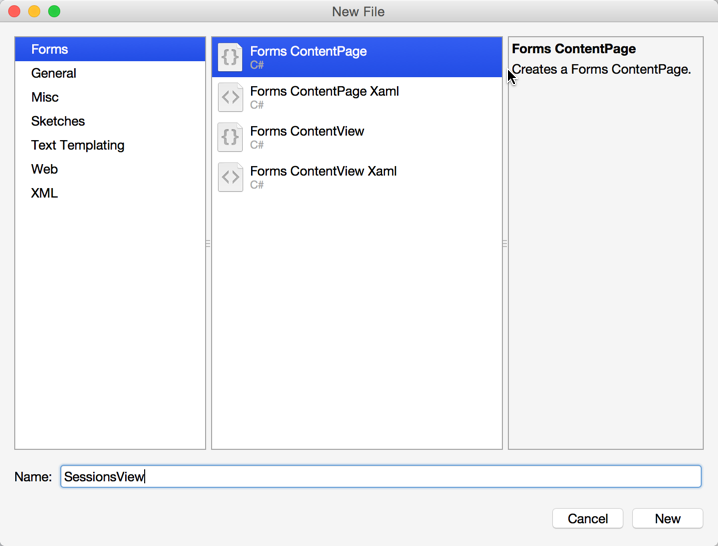
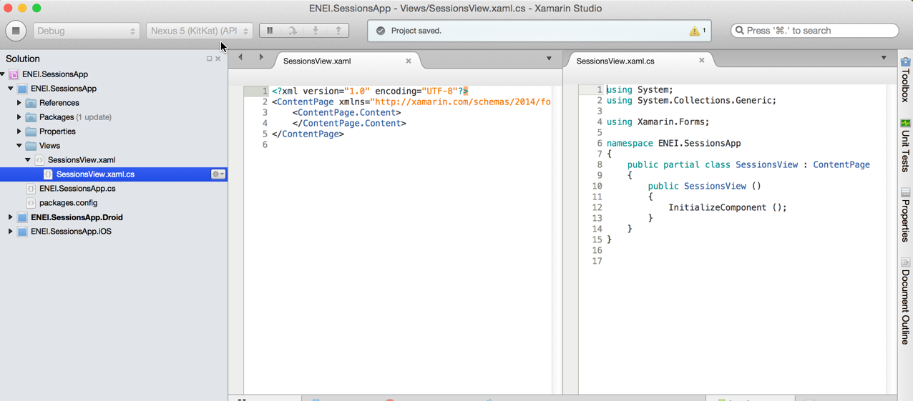
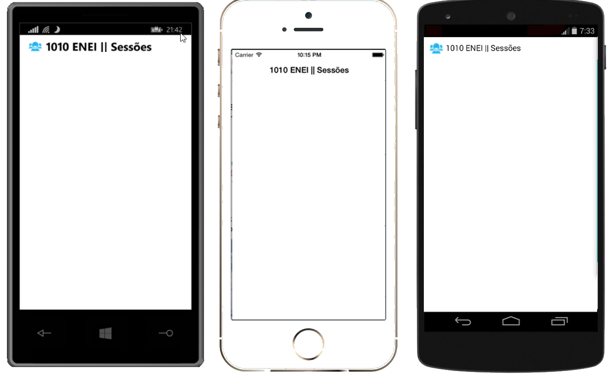
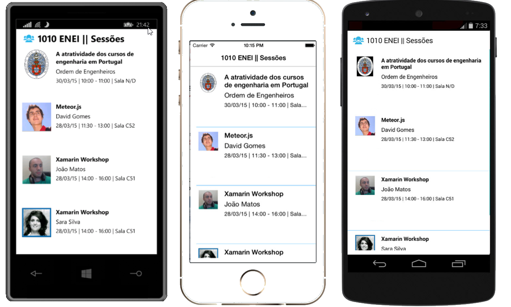
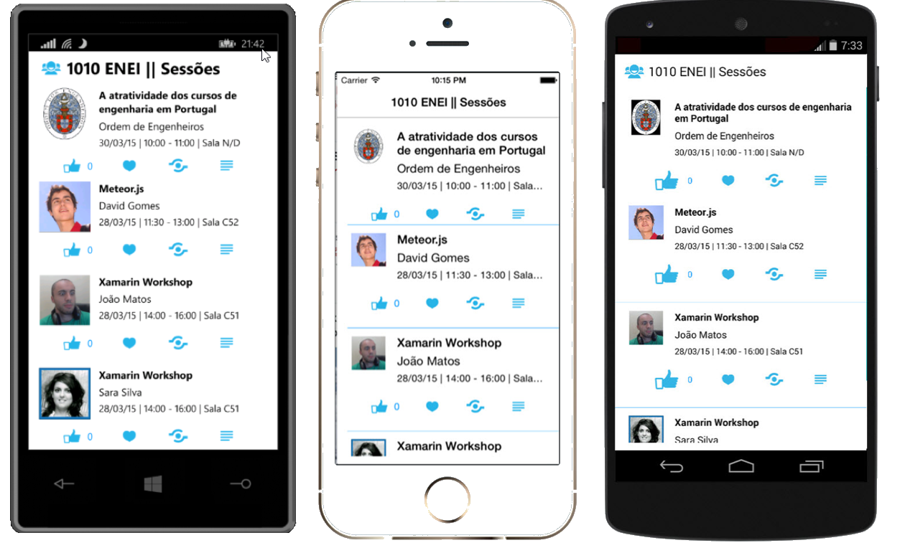

# 1010 ENEI || Xamarin Workshop

> Previous step [**Guide 2: Create the model and the data source**](2. Create the model and the data source.md)

## Guides 3. Create the SessionsView

In this step, you will create the user interface to the SessionsView (which is the main page) to show the data defined in the last step.

#### Create the Xaml page

In Xamarin Studio, select the ENEI.SessionsApp project and create a folder called “Views”, as described in figure 25 and figure 26:

**Figure 25: Creating new folder**

**Figure 26: The Views folder in the project**

Then select the folder “Views” , do a double click with the mouse to open the context and the click in “Add”> “New File...” as described in figure 27:

**Figure 27: Add new file**

Select “Forms ContentPage Xaml”, as following:

**Figure 28: Adding a Xaml page**

The result will be something as following:

**Figure 29: The xaml page code**

The SessionsView xaml is defined by:

* The **xaml** file which define the user interface 
* The **cs** file which define the code behind 

> This approach is really useful when designers and developers work together, and using MVVM pattern it allow to have UI separated from the behavior of the page.

> See more about Xaml in this article [Xamarin.Forms Xaml Basics](http://developer.xamarin.com/guides/cross-platform/xamarin-forms/xaml-for-xamarin-forms/). 

Now let’s change the App.cs in ENEI.SessionsApp to use the SessionsView:

    public class App : Application
    {
        public App()
        {
            // The root page of your application
            MainPage = new NavigationPage(new SessionsView())
            {
                BarBackgroundColor = Color.White,
                BarTextColor = Color.Black
            };
        }

In this case, you defined the MainPage with a NavigationPage which content is defined by SessionView. The NavigationPage is required when the application required navigation between page and the application should have only one NavigationPage.
At this moment, if you run the application you will not have content and you should have something like as described in figure 30:

**Figure 30: The xaml page code**

Now let’s define the UI…

#### Create the Header

The first thing you should define is the Title and the Icon used in the header of the page, something like as following:

**Figure 31: The header**

Which code can be:

     <ContentPage xmlns="http://xamarin.com/schemas/2014/forms"
             xmlns:x="http://schemas.microsoft.com/winfx/2009/xaml"
             x:Class="ENEI.SessionsApp.Views.SessionsView"
             Title="1010 ENEI || Sessões"
             BackgroundColor="White"
             Icon="ic_action_users.png">

This will be showed in Android and in iOS but for Windows Phone 8.0 we need to create a workaround for it, as we will see below.

> In Android, more specific in the MainActivity is required (in this case) to set the Icon in ActionBar as following: ActionBar.SetIcon(Resource.Drawable.ic_action_users); 

The **SessionsView** is a **ContentPage** which is a simple page provided by [Xamarin Forms API](http://api.xamarin.com/?link=N%3aXamarin.Forms) (see more in [Xamarin Forms Gallery](http://developer.xamarin.com/guides/cross-platform/xamarin-forms/controls/pages/)). To define its content, you should use [controls layouts](http://developer.xamarin.com/guides/cross-platform/xamarin-forms/controls/layouts/) like StackLayout or Grid, for example.

**Figure 32: Control Layouts**

This way, let’s choose the Grid as control layout to define two rows and one columns, where:

* The first row has the header for Windows Phone (hidden to the others platforms)
* The second row has the ListView to show the sessions. 

The code for it will be something like as following:

        <?xml version="1.0" encoding="utf-8" ?>
        <ContentPage xmlns="http://xamarin.com/schemas/2014/forms"
             xmlns:x="http://schemas.microsoft.com/winfx/2009/xaml"
             x:Class="ENEI.SessionsApp.Views.SessionsView"
             Title="1010 ENEI || Sessões"
             BackgroundColor="White"
             Icon="ic_action_users.png">
           <Grid BackgroundColor="White">
             <Grid.RowDefinitions>
               <RowDefinition Height="Auto" />
               <RowDefinition Height="*" />
             </Grid.RowDefinitions>
           <!-- Title - Only for WP-->
           <StackLayout Grid.Row="0" Orientation="Horizontal" Padding="20,10,0,0">
           <StackLayout.IsVisible>
              <OnPlatform Android="false"
                    WinPhone="true"
                    iOS="false"
                    x:TypeArguments="x:Boolean" />
           </StackLayout.IsVisible>
           <Image WidthRequest="48" 
             HeightRequest="38" 
             Source="Images/ic_action_users.png"/>
           <Label FontSize="Large" FontAttributes="Bold"
                  TextColor="Black">
           <OnPlatform Android=""
                    WinPhone="1010 ENEI || Sessões"
                    iOS=""
                    x:TypeArguments="x:String" />
            </Label>
           </StackLayout>
           <!-- ListView will be defined here -->
          </Grid>
        </ContentPage>

##### Defining the Images for each platform

In the last step you used the image “ic_action_users.png” which need to be add to each project (ENEI.SessionApp.Android, ENEI.SessionApp.iOS and ENEI.SessionApp.WinPhone). This way, each app will have its own images, which should be defined following the platform specifications, i.e., each image should provide the right resolution by platform.

Get the images & assets by platform »»here»», and see more about this subject in this [article](http://developer.xamarin.com/guides/cross-platform/xamarin-forms/working-with/images/).

At this moment, you should have

 
**Figure 33: The Windows Phone, iOS and Android applications**

#### Create the Listview

The next step is to define the list of the session from the 1010 ENEI, which were defined in the topic “The Data Source”. 
To show the list of the session you will use a ListView which must have:

* **ItemsSource** defined with the list of sessions
* **ItemTemplate** defined with the template for each row 

Let’s define the first version of the ListView as following:

    <!-- ListView will be defined here -->
    <ListView x:Name="SessionsList"
                 Grid.Row="1"
                 ItemSelected="SessionsList_OnItemSelected"
                 ItemsSource="{Binding Sessions}"
                 SeparatorColor="#0094FF">
      <!--
                Setting the HasUnevenRows property tells the list view to render
                each cell with a different height.
            -->
      <ListView.RowHeight>
        <OnPlatform Android="150"
                    WinPhone="180"
                    iOS="150"
                    x:TypeArguments="x:Int32" />
      </ListView.RowHeight>
    </ListView>
  

The Listview has the name “SessionsList”, which is defined in the second row of the grid that define the root content of the page, it has the “ItemSelected” subscribed to ignore the “SelectItem”, the “SeparatorColor" is defined as blue and the “ItemsSource” is binding with the “Sessions” property (which is a property from the object defined in “BindingContext”.

> Data bindings allow properties of two objects to be linked so that a change in one causes a change in the other. See more about it in these article [Data Binding Basics](http://developer.xamarin.com/guides/cross-platform/xamarin-forms/xaml-for-xamarin-forms/data_binding_basics/) and [From Data Bindings to MVVM](http://developer.xamarin.com/guides/cross-platform/xamarin-forms/xaml-for-xamarin-forms/data_bindings_to_MVVM/).

Each row from the ListView can be defined with static or dynamic size. In this case was defined a static size for each platform (related with screen resolution). A developer that needs to have different row’s size depending the data showed is recommended to use the property HasUnevenRows.

To complete, in code behind, you need to define the Sessions that should be an “ObservableCollection” of Session (this kind of list allow to notify the UI each time an object is removed or added in the list).  You need to get the sessions from the “SessionsDataSource” and you need to define the “BindingContext”. The data should be loaded in the “OnAppearing” method and is not recommended to load it in the constructor of the page, because it will increase the time required to create the page which can create issues.

    public partial class SessionsView : ContentPage
    {
        public SessionsView()
        {
            InitializeComponent();
            Sessions = new ObservableCollection<Session>();
            BindingContext = this;

        }

        public ObservableCollection<Session> Sessions { get; set; }

        protected override void OnAppearing()
        {
            base.OnAppearing();
            if (Sessions.Count == 0)
            {
                var sessions = SessionsDataSource.GetSessions();
                foreach (var session in sessions)
                {
                    Sessions.Add(session);
                }
            }
        }
        private void SessionsList_OnItemSelected(object sender, SelectedItemChangedEventArgs e)
        {
            if (SessionsList.SelectedItem == null)
            {
                return;
            }

            SessionsList.SelectedItem = null;
        }
    }

 
> In this case, you will not use MVVM pattern, which is extremely recommended in real projects. To keep it simple the code behind will have the behavior used by UI that in a MVVM pattern is defined in the ViewModel.

#### Create the ItemTemplate

The Listview has the “ItemTemplate” property that allows defining a “DataTemplate” for each row. In this case you will define a template as described in figure 34, which code will be:

     <ListView.ItemTemplate>
         <DataTemplate>
                    <ViewCell>
                        <ViewCell.View>
                            <Grid BackgroundColor="Transparent" Padding="20,0,20,0">
                                <Grid.ColumnDefinitions>
                                    <ColumnDefinition Width="Auto" />
                                    <ColumnDefinition Width="*" />
                                </Grid.ColumnDefinitions>
                                <Grid.RowDefinitions>
                                    <RowDefinition Height="5" />
                                    <RowDefinition Height="Auto" />
                                    <RowDefinition Height="48" />
                                    <RowDefinition Height="5" />
                                </Grid.RowDefinitions>
                                <!-- Define the Image from Speaker -->
                                <Image Grid.Row="1"
                                       HorizontalOptions="StartAndExpand"
                                       Source="{Binding Speaker.ImageUrl}"
                                       VerticalOptions="Start">
                                    <Image.WidthRequest>
                                        <OnPlatform Android="50"
                                                    WinPhone="100"  iOS="50"
                                                    x:TypeArguments="x:Double" />
                                    </Image.WidthRequest>
                                    <Image.HeightRequest>
                                        <OnPlatform Android="50"
                                                    WinPhone="100" iOS="50"
                                                    x:TypeArguments="x:Double" />
                                    </Image.HeightRequest>
                                </Image>
                                <!-- Define the Image from Speaker -->
                                <StackLayout Grid.Row="1"
                                             Grid.Column="1"
                                             HorizontalOptions="FillAndExpand"
                                             Padding="10,0,0,0">
                                    <Label Font="Medium"
                                           FontAttributes="Bold"
                                           Text="{Binding Name}"
                                           TextColor="Black" />
                                    <Label Font="Medium"
                                           LineBreakMode="TailTruncation"
                                           Text="{Binding Speaker.Name}"
                                           TextColor="Black" />
                                    <Label Font="Small"
                                           LineBreakMode="TailTruncation"
                                           TextColor="Black" Text="{Binding Details}"/>
                                </StackLayout>               
                                <!-- Define the menu for each session -->  
                           </Grid>
                       </ViewCell.View>
                    </ViewCell>
                </DataTemplate>
      </ListView.ItemTemplate>

**Figure 34: A row in listview**

Running the application you will have the following:

**Figure 35: The Windows Phone, iOS and Android application showing sessions from 1010 ENEI**

#### Create the menu for each Session

To create the menu for each session as described in figure 36, you need to change the ItemTemplate defined above:

**Figure 36: The session’s menu**

The implementation can be something as following:

    <Grid Grid.Row="2" Grid.Column="0"  Grid.ColumnSpan="2" Padding="0,5,0,0">
                  <Grid.ColumnDefinitions>
                    <ColumnDefinition Width="*" /> <ColumnDefinition Width="Auto" />
                    <ColumnDefinition Width="*" /> <ColumnDefinition Width="Auto" /><ColumnDefinition Width="*" />
                    <ColumnDefinition Width="Auto" /> <ColumnDefinition Width="*" /><ColumnDefinition Width="Auto" />
                    <ColumnDefinition Width="*" />
                  </Grid.ColumnDefinitions>
                  <StackLayout Grid.Column="1" Orientation="Horizontal">
                    <Image>
                      <Image.WidthRequest>
                        <OnPlatform Android="48" WinPhone="48" iOS="30"  x:TypeArguments="x:Double" />
                      </Image.WidthRequest>
                      <Image.HeightRequest>
                        <OnPlatform Android="48"  WinPhone="48" iOS="30" x:TypeArguments="x:Double" />
                      </Image.HeightRequest>
                      <Image.Source>
                        <OnPlatform x:TypeArguments="ImageSource">
                          <OnPlatform.iOS>  <FileImageSource File="ic_action_like.png" />
                          </OnPlatform.iOS>
                          <OnPlatform.Android> <FileImageSource File="ic_action_like.png" />
                          </OnPlatform.Android>
                          <OnPlatform.WinPhone><FileImageSource File="Images/ic_action_like.png" />
                          </OnPlatform.WinPhone>
                        </OnPlatform>
                      </Image.Source>
                    </Image>
                    <Label Font="Small" Text="{Binding NumLikes}" TextColor="#0094FF" VerticalOptions="Center" />
                  </StackLayout>
                  <Image Grid.Column="3" Source="{Binding IsFavorite, Converter={StaticResource FavoriteImageConverter}}">
                    <Image.WidthRequest>
                      <OnPlatform Android="48" WinPhone="48" iOS="30"  x:TypeArguments="x:Double" />
                    </Image.WidthRequest>
                    <Image.HeightRequest>
                      <OnPlatform Android="48"  WinPhone="48"    iOS="30"  x:TypeArguments="x:Double" />
                    </Image.HeightRequest>
                  </Image>
                  <Image Grid.Column="5">
                    <Image.WidthRequest>
                      <OnPlatform Android="30"  WinPhone="48" iOS="30" x:TypeArguments="x:Double" />
                    </Image.WidthRequest>
                    <Image.HeightRequest>
                      <OnPlatform Android="30"  WinPhone="48" iOS="30" x:TypeArguments="x:Double" />
                    </Image.HeightRequest>
                    <Image.Source>
                      <OnPlatform x:TypeArguments="ImageSource">
                        <OnPlatform.iOS><FileImageSource File="ic_action_share_2.png" /></OnPlatform.iOS>
                        <OnPlatform.Android><FileImageSource File="ic_action_share_2.png" /></OnPlatform.Android>
                        <OnPlatform.WinPhone>
      <FileImageSource File="Images/ic_action_share_2.png" /></OnPlatform.WinPhone>
                      </OnPlatform> </Image.Source>  </Image>
                  <Image Grid.Column="7">
                    <Image.WidthRequest>
                      <OnPlatform Android="30" WinPhone="48" iOS="30"   x:TypeArguments="x:Double" />
                    </Image.WidthRequest>
                    <Image.HeightRequest>
                      <OnPlatform Android="30"   WinPhone="48"  iOS="30" x:TypeArguments="x:Double" />
                    </Image.HeightRequest>
                    <Image.Source>
                      <OnPlatform x:TypeArguments="ImageSource">
                        <OnPlatform.iOS>   <FileImageSource File="ic_action_list.png" />
                        </OnPlatform.iOS>
                        <OnPlatform.Android><FileImageSource File="ic_action_list.png" />
                        </OnPlatform.Android>
                        <OnPlatform.WinPhone> <FileImageSource File="Images/ic_action_list.png" />
                        </OnPlatform.WinPhone>
                      </OnPlatform>
                    </Image.Source>
                  </Image>
                </Grid>
         

> The SessionDetailsView will have a similar implementation for the header as defined in SessionsView, the difference it is the title value, which will be defined by the Session’s name.

The code above contains a grid with four images: Like, Favorite, Share and Details. And for each one we need to subscribe the Tap event using the “GestureRecognizers” from the Image, this way you need to define for each image its TapGesture as following:

     <Image.GestureRecognizers>
     <TapGestureRecognizer x:Name="FavoriteGesture"
                 CommandParameter="{Binding}" Tapped="FavoriteGestureRecognizer_OnTapped" />
    </Image.GestureRecognizers>

Where the event’s handler will be defined as following:

      private void FavoriteGestureRecognizer_OnTapped(object sender, EventArgs e)
        {
            var tappedEventArg = e as TappedEventArgs;
            if (tappedEventArg != null)
            {
                var session = tappedEventArg.Parameter as Session;
                if (session != null)
                {
                    session.IsFavorite = !session.IsFavorite;
                }
            }
        }

Do the same for “Like” and for Share and Details we will see it in next steps.

##### Running the application

At this moment you should have the UI from the 1010 ENEI Sessions App as described in figure 37:

**Figure 37: The Windows Phone, iOS and Android applications**

> Next step [**Guide 4: Create the SessionDetailsView**](4. Create the SessionDetailsView.md)
