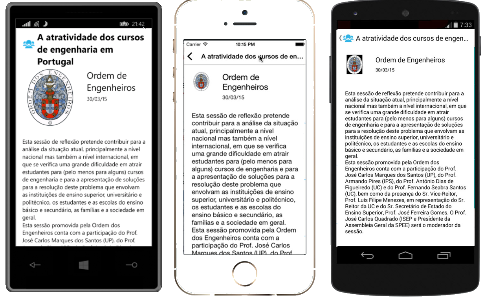

# 1010 ENEI || Xamarin Workshop

> Previous step [**Guide 3: Create the SessionsView**](3. Create the SessionsView.md)
 
## Guides 4. Create the SessionDetailsView

In the last step, you created the menu for each Session and it was created the “Details” option, which has the goal to show the details from a selected session. 

Let’s create the SessionDetailsView!

Create a new Xaml page, like it you did to create the SessionsView page. Then open the SessionDetailsView and you should have something as following:


Then create the content, as following:

    <?xml version="1.0" encoding="utf-8" ?>
    <ContentPage x:Class="ENEI.SessionsApp.View.SessionDetailsView"
             xmlns="http://xamarin.com/schemas/2014/forms"
             xmlns:x="http://schemas.microsoft.com/winfx/2009/xaml"
             BackgroundColor="White"    Icon="ic_action_users.png">
    <StackLayout BackgroundColor="White" Spacing="20">
      <StackLayout Orientation="Horizontal" Padding="20,10,0,0">
        <StackLayout.IsVisible>
          <OnPlatform Android="false"
                      WinPhone="true" iOS="false”   x:TypeArguments="x:Boolean" />
        </StackLayout.IsVisible>
        <Image WidthRequest="48" HeightRequest="38" Source="Images/ic_action_users.png"/>
        <Label FontSize="Large" FontAttributes="Bold" Text="{Binding Name}"
             TextColor="Black"/>
      </StackLayout>
      <StackLayout Orientation="Horizontal" Padding="20,20,20,0" Spacing="20">
            <Image HorizontalOptions="Start"
                   Source="{Binding Speaker.ImageUrl}"
                   VerticalOptions="Start">
                <Image.WidthRequest>
                    <OnPlatform Android="50" WinPhone="200" iOS="50"
                                x:TypeArguments="x:Double" />
                </Image.WidthRequest>
                <Image.HeightRequest>
                    <OnPlatform Android="50" WinPhone="200"    iOS="50"
                                x:TypeArguments="x:Double" />
                </Image.HeightRequest>
            </Image>
            <StackLayout HorizontalOptions="Start" Padding="10,0,0,0">
                <Label Font="Large"
                       HorizontalOptions="Start"
                       LineBreakMode="WordWrap"
                       Text="{Binding Speaker.Name}"
                       TextColor="Black" />
                <Label Font="Small"
                       HorizontalOptions="Start"
                       LineBreakMode="TailTruncation"
                       Text="{Binding Date}"
                       TextColor="Black" />
            </StackLayout>
        </StackLayout>

      <ScrollView VerticalOptions="FillAndExpand"  Padding="20,20,20,0">
            <Label Font="Medium"
                   HorizontalOptions="Start"
                   LineBreakMode="WordWrap"
                   Text="{Binding Description}"
                   TextColor="Black" />
        </ScrollView>
    </StackLayout>
    </ContentPage>


And in code behind define the BindingContext and the Title, as following: 

    public partial class SessionDetailsView : ContentPage
    {
        private readonly Session _session;

        public SessionDetailsView(Session session)
        {
            _session = session;
            InitializeComponent();
            Title = session.Name;
            BindingContext = session;
        }
    }


This page will have the BindingContext defined with session object, but could be the page as in SessionsView.

#### The Details gesture

Now that you have the new page created, you need to connect the both pages and it is possible through the “Detail” option for each session in Listview. This way, in the SessionsView we need to use the details gesture to navigate from the SessionsView to the SessionDetailsView, sending the selected session. The implementation can be something as following:

       private void DetailsGesture_OnTapped(object sender, EventArgs e)
        {
            var tappedEventArg = e as TappedEventArgs;
            if (tappedEventArg != null)
            {
                var session = tappedEventArg.Parameter as Session;
                if (session != null)
                {
                    Navigation.PushAsync(new SessionDetailsView(session), true);
                }
            }
        }


#### Running the application

At this moment, you should navigate to the Session details view, which result should be as described in figure 38:



**Figure 38: The Windows Phone, iOS and Android applications**

> The navigation from SessionDetailsView is made using the back button provided in iOS and Android pages and by physical back button from Windows Phone, which do not require implementation.

   
-

> Next step [**Guide 5: Add ShareService.md**](5. Add ShareService.md)

