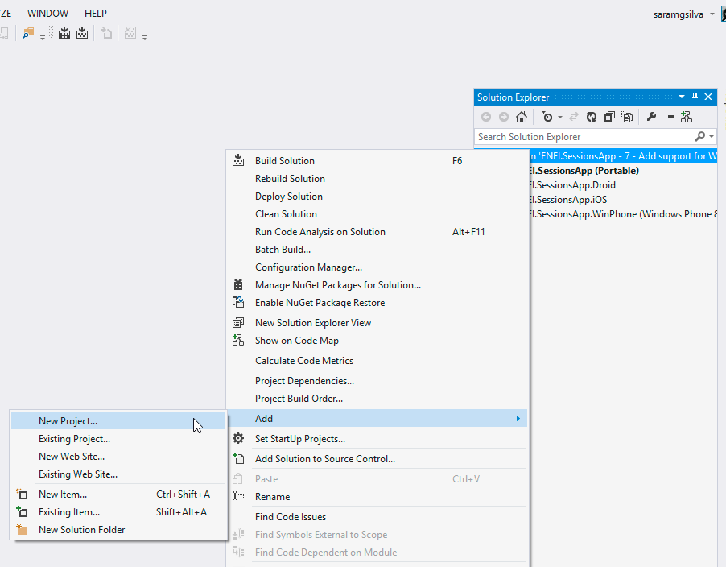
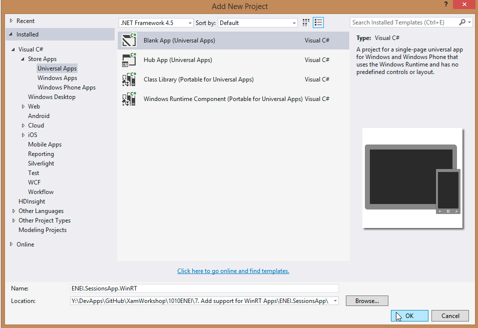
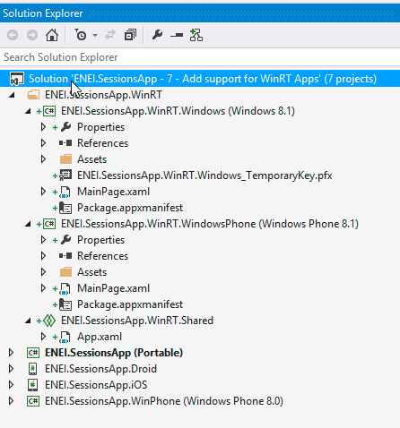
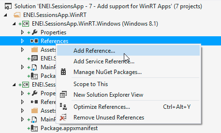
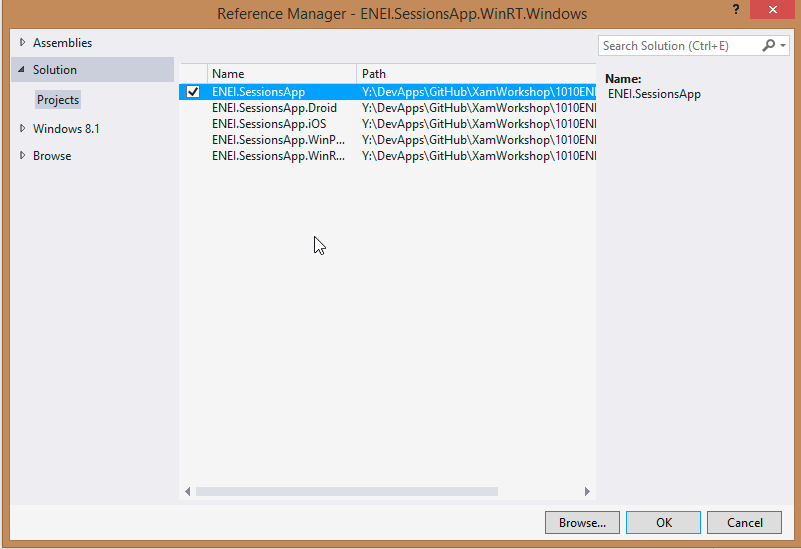
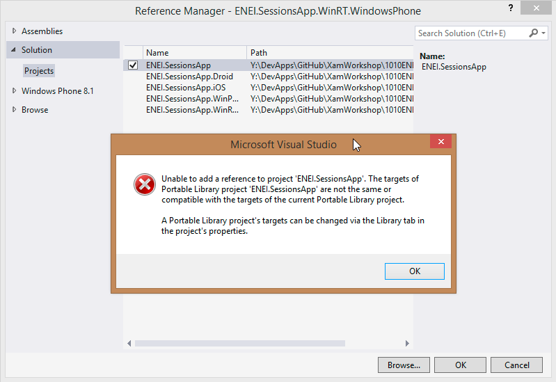
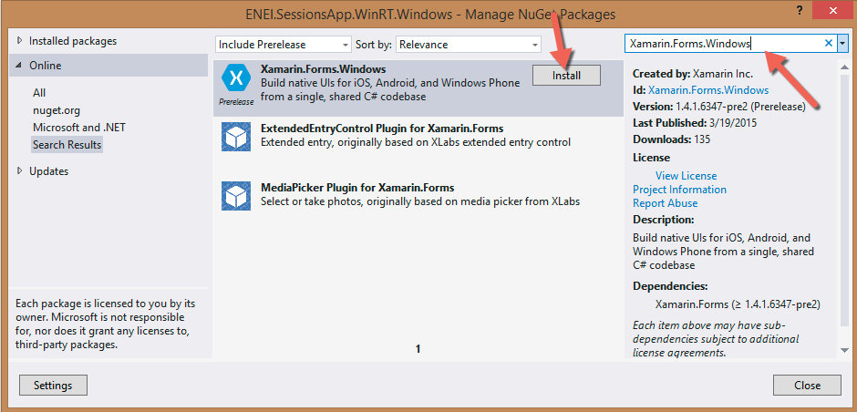
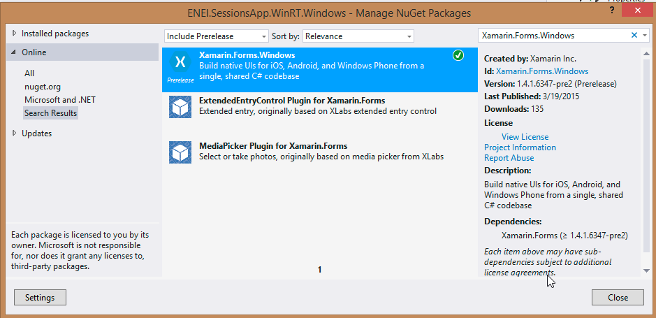

# 1010 ENEI || Xamarin Workshop

> Previous step [**Guide 6: Add splah screen, name and version**](6. Add splah screen, name and version.md)

### 7. Add support for WinRT Apps

In this step you will learn how to add support to WinRT apps, which means you will create an Universal apps that will use [Xamarin Forms for Windows (Preview)](https://www.nuget.org/packages/Xamarin.Forms.Windows/).

To start, create a new project based in an Universal App template, as described in figure 39 and figure 40:

**Figure 39: Create new project**

**Figure 40: Blank App (Universal App)**

The result will be:

**Figure 41: The solution**

Now, you will add the ENEI.SessionsApp reference to the WinRT project, as described in figure 42 and figure 43:

**Figure 42: Add Reference**

**Figure 43: Selecting the ENEI.SessionApp**

In the Windows Phone 8.1 (WinRT) app we can get an error as following:

**Figure 44: Error adding ENEI.SessionsApp**

This error means that the ENEI.SessionsApp is a portable class library (PCL) that does not have support to Windows Phone 8.1 (WinRT). This way, you need to change the PCL project (in Properteis) to support this target, as described in figure 45:

**Figure 45: Add support to Windows Phone 8.1 (WinRT)**

After it, you will have the references added to each project, as following:

**Figure 46: The references**

Before you create code, you need to install the Xamarin Forms Windows (Preview) NuGet Package as following:

**Figure 47: Opening the “Manage NuGet Packages…”**

**Figure 48: Installing the Xamarin Forms Windows (Preview)**

**Figure 49: The Xamarin Forms Windows (Preview) installed**

Let’s do some code!

In general, you should do not so many changes to have the WinRT apps. First, you need to start by doing the Xamarin Forms setup, this way you need change the OnLaunched method in the App.xaml.cs has following:

      protected override void OnLaunched(LaunchActivatedEventArgs e)
        {
           #if DEBUG
            if (System.Diagnostics.Debugger.IsAttached)
            {
                this.DebugSettings.EnableFrameRateCounter = true;
            }
          #endif

            Frame rootFrame = Window.Current.Content as Frame;

            // Do not repeat app initialization when the Window already has content,
            // just ensure that the window is active
            if (rootFrame == null)
            {
                // Create a Frame to act as the navigation context and navigate to the first page
                rootFrame = new Frame();

                // TODO: change this value to a cache size that is appropriate for your application
                rootFrame.CacheSize = 1;

                global:Xamarin.Forms.Forms.Init(e);

       ….

       

Like in the others platform, the **Init** method will initialized the Xamarin Forms, in this case is need to send the LaunchActivatedEventArgs.

And we need to change the MainPage contructor, from each WinRT app, to:

      
       public MainPage()
        {
            this.InitializeComponent();

            this.NavigationCacheMode = NavigationCacheMode.Required;
            LoadApplication(new ENEI.SessionsApp.App());
        }

and the page type must be change to:

* In Windows Phone 8.1 (WinRT):

           <forms:WindowsPhonePage
               x:Class="ENEI.SessionsApp.WinRT.MainPage"
               xmlns="http://schemas.microsoft.com/winfx/2006/xaml/presentation"
               xmlns:x="http://schemas.microsoft.com/winfx/2006/xaml"
               xmlns:forms="using:Xamarin.Forms.Platform.WinRT"
               xmlns:d="http://schemas.microsoft.com/expression/blend/2008"
               xmlns:mc="http://schemas.openxmlformats.org/markup-compatibility/2006"
               mc:Ignorable="d"
               Background="{ThemeResource ApplicationPageBackgroundThemeBrush}">            
      
            </forms:WindowsPhonePage>        

* In Windows 8.1 Store App (WinRT):

          <forms:WindowsPage
             x:Class="ENEI.SessionsApp.WinRT.MainPage"
             xmlns="http://schemas.microsoft.com/winfx/2006/xaml/presentation"
             xmlns:x="http://schemas.microsoft.com/winfx/2006/xaml"
             xmlns:forms="using:Xamarin.Forms.Platform.WinRT"
             xmlns:d="http://schemas.microsoft.com/expression/blend/2008"
             xmlns:mc="http://schemas.openxmlformats.org/markup-compatibility/2006"
             mc:Ignorable="d"
             Foreground="Black"
             Background="White">
          </forms:WindowsPage>

Now, it is need to define the background color from the NavigationPage to white, which should be defined from the beginner:

            MainPage = new NavigationPage(new SessionsView())
            {  
                BarBackgroundColor = Color.White,
                BarTextColor = Color.Black,
                BackgroundColor = Color.White,
            };

At this moment, you will see the header in the right way but the images from the menu are not displayed, it because each image was defined by:

                  <Image Grid.Column="7">
                    <Image.WidthRequest>
                      <OnPlatform Android="30"
                                  WinPhone="48"
                                  iOS="30"
                                  x:TypeArguments="x:Double" />
                    </Image.WidthRequest>
                    <Image.HeightRequest>
                      <OnPlatform Android="30"
                                  WinPhone="48"
                                  iOS="30"
                                  x:TypeArguments="x:Double" />
                    </Image.HeightRequest>
                    <Image.Source>
                      <OnPlatform x:TypeArguments="ImageSource">
                        <OnPlatform.iOS>
                          <FileImageSource File="ic_action_list.png" />
                        </OnPlatform.iOS>
                        <OnPlatform.Android>
                          <FileImageSource File="ic_action_list.png" />
                        </OnPlatform.Android>
                        <OnPlatform.WinPhone>
                          <FileImageSource File="Images/ic_action_list.png" />
                        </OnPlatform.WinPhone>
                      </OnPlatform>
                    </Image.Source>
                    <Image.GestureRecognizers>
                      <TapGestureRecognizer x:Name="DetailsGesture"
                                            CommandParameter="{Binding}"
                                            Tapped="DetailsGesture_OnTapped" />
                    </Image.GestureRecognizers>
                  </Image>

Which are using OnPlatform to set the image’s source and the image’s height and width. In the preview version used, is not possible to use but in future it will work to Windows apps like works for the others platforms. 

This way, you need to create a workaround to make sure the images will be load and it will be use converters, as following:

         <ContentPage.Resources>
            <ResourceDictionary>
              <converters:FavoriteImageConverter x:Key="FavoriteImageConverter" />
              <converters:ImageSizeConverter x:Key="ImageSizeConverter"/>
              <converters:ImageUrlConverter x:Key="ImageUrlConverter"/>
              <converters:RowHeightConverter x:Key="RowHeightConverter"/>
            </ResourceDictionary>
         </ContentPage.Resources>

And 

               <Image Grid.Column="7"
                      Source="{Binding Converter={StaticResource ImageUrlConverter}, ConverterParameter=Details}"
                      HeightRequest="{Binding Converter={StaticResource ImageSizeConverter}}"
                      WidthRequest="{Binding Converter={StaticResource ImageSizeConverter}}">
                    <Image.GestureRecognizers>
                      <TapGestureRecognizer x:Name="DetailsGesture"
                                            CommandParameter="{Binding}"
                                            Tapped="DetailsGesture_OnTapped" />
                    </Image.GestureRecognizers>
                  </Image>

Where the converters are defined by:

> The **ImageSizeConverter** to define the **Height** and the **Width** for the images

    public class ImageSizeConverter:IValueConverter
    {
        public object Convert(object value, Type targetType, object parameter, CultureInfo culture)
        {
            if (value != null)
            {

                if (Device.OS == TargetPlatform.Android || Device.OS == TargetPlatform.Windows)
                {
                    return 48;
                }
                if (Device.OS == TargetPlatform.iOS)
                {
                    return 30;
                }
            }
            return value;
        }

        public object ConvertBack(object value, Type targetType, object parameter, CultureInfo culture)
        {
            throw new NotImplementedException();
        }
    }            
             

> The **ImageUrlConverter**, to define the path for the images:

                   
    public class ImageUrlConverter:IValueConverter
    {
        public object Convert(object value, Type targetType, object parameter, CultureInfo culture)
        {
            if (parameter !=null && !string.IsNullOrEmpty(parameter.ToString()))
            {
                var imageUrl = string.Empty;
                switch (parameter.ToString())
                {
                    case "Like":
                        imageUrl= Device.OS == TargetPlatform.WinPhone || Device.OS == TargetPlatform.Windows ?
                        "Images/ic_action_like.png":
                        "ic_action_like.png";
                        break;
                    case "Share":
                        imageUrl = Device.OS == TargetPlatform.WinPhone || Device.OS == TargetPlatform.Windows ?
                       "Images/ic_action_share_2.png" :
                       "ic_action_share_2.png";
                        break;
                    case "Details":
                        imageUrl = Device.OS == TargetPlatform.WinPhone || Device.OS == TargetPlatform.Windows ?
                       "Images/ic_action_list.png" :
                       "ic_action_list.png";
                        break;
                }

                return ImageSource.FromFile(imageUrl);
            }
            return null;
        }

        public object ConvertBack(object value, Type targetType, object parameter, CultureInfo culture)
        {
            throw new NotImplementedException();
        }
    }

> The **RowHeightConverter** to define the size of the row from the ListView:

    public class RowHeightConverter:IValueConverter
    {
        public object Convert(object value, Type targetType, object parameter, CultureInfo culture)
        {
            if (value != null)
            {

                if (Device.OS == TargetPlatform.Android || Device.OS == TargetPlatform.iOS)
                {
                    return 150;
                }
                if (Device.OS == TargetPlatform.WinPhone)
                {
                    return 180;
                }
                if (Device.OS == TargetPlatform.Windows)
                {
                    return 200;
                }
            }
            return value;
        }

        public object ConvertBack(object value, Type targetType, object parameter, CultureInfo culture)
        {
            throw new NotImplementedException();
        }
    }

At this moment if you run the applications you will have something as following:

**Figure 50: The WinRT apps**

> Next step [**Wrapping Up**](8. Wrapping Up.md)
