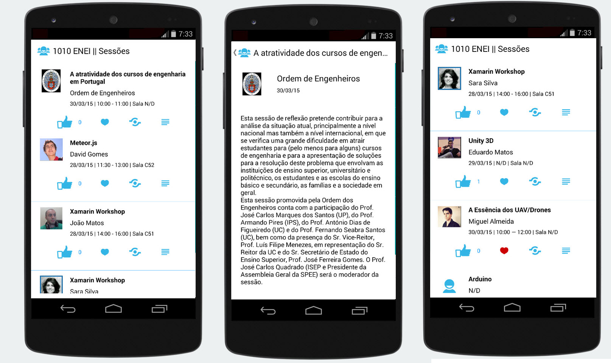
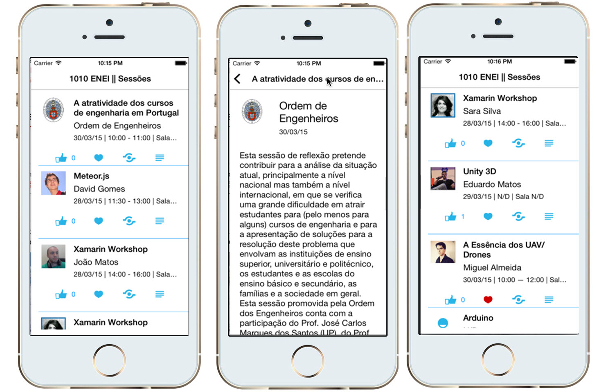
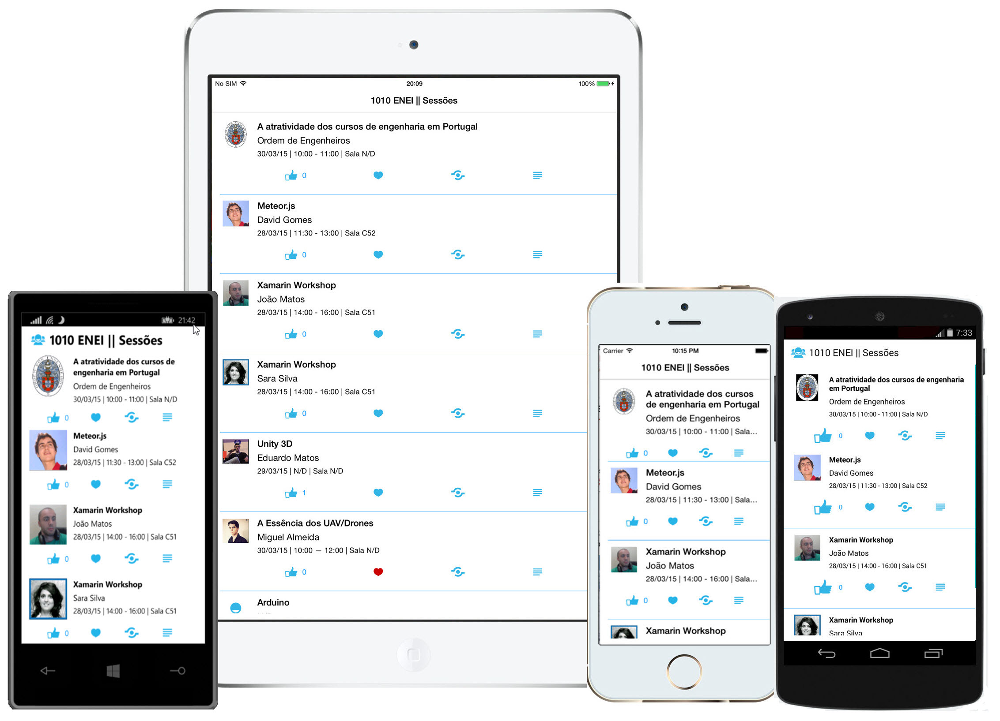

# 1010 ENEI || Xamarin Workshop

## Wrapping Up

Xamarin Forms allow us to quickly create native applications for the different platforms with the same code base. This way, it will reduce the maintenance time and increases the time to improve the application.



**Figure 51: The Android application**


**Figure 52: The iOS application**


**Figure 53: The Windows Phone application**


**Figure 54: The 1010 ENEI Sessions App**