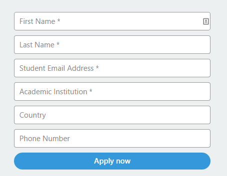
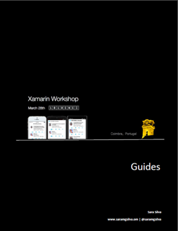
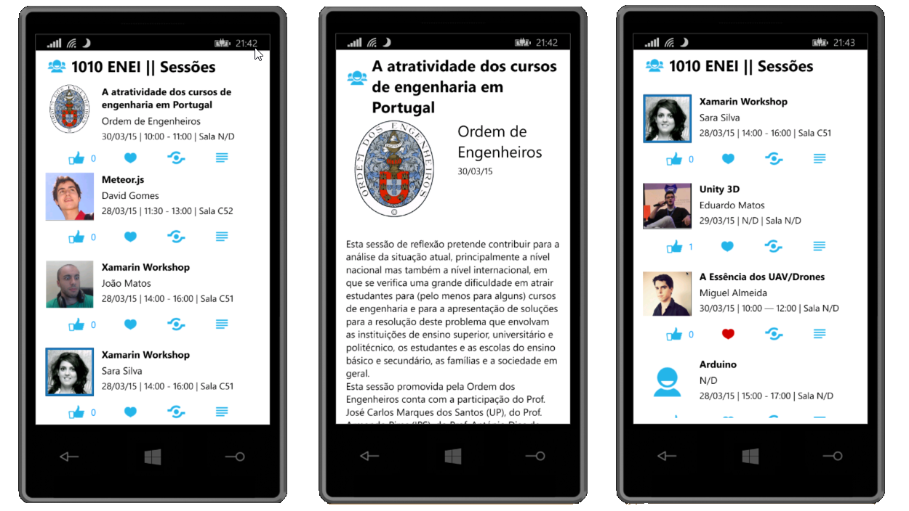

<MTMarkdownOptions output='html4'>
	
</MTMarkdownOptions>

**Xamarin Workshop**

##  :white_medium_square: Table of contents
* [Scope](#white_medium_square-scope)
* [Abstract](#white_medium_square-abstract)
* [Requirements](#white_medium_square--requirements)
* [Resources](#white_medium_square--resources)
* [Sample Status](#white_medium_square-samples-status)
	* [By platform](#by-platform)
	* [By demo](#by-demo)
* [Guides](#white_medium_square-guides)
* [Slides](#white_medium_square-slides)
* [Screenshots](#white_medium_square-screenshots)
* [Contributors](#white_medium_square-contributors)
* [Contributions](#white_medium_square-contributions)
* [License](#white_medium_square-license)
 

##  :white_medium_square: Scope
This workshop will be realized in [1010 ENEI](https://enei.pt/) at [University of Coimbra (Portugal)](http://www.uc.pt/en), March 28th 2015.

> The **Portuguese National Meeting of IT Students (ENEI)** is an annual event which main goal is to gather the national IT student community for a few days. 
ENEI was designed to allow access to new knowledge as well as to promote the sharing of experience, networking and social activities. The 10th edition will take place this year (2015) in Coimbra, from the 27th to 30th of March.

:warning: The Workshop will be presented in portuguese.

##  :white_medium_square: Abstract

In this [Xamarin Workshop](https://enei.pt/eventos/xamarin/), you will learn what's Xamarin and its products, how to create mobile cross-platform applications, using Xamarin for Android, iOS and Windows. You will learn the two most used patterns in this kind of applications and at the end you will create your own 1010 ENEI Sessions App.

## :white_medium_square:  Requirements

:pushpin: Each student should get your own Xamarin Student License for free in [xamarin.com/student](https://xamarin.com/student).

If you know portuguese language, you can read the article in [Programar EMagazine](http://www.revista-programar.info/): ["Xamarin: Sem custos para estudantes"](http://www.revista-programar.info/artigos/xamarin-sem-custos-para-estudantes/).

**Each student should:**

* Have a Windows or a Mac device;
* Install [Xamarin Studio](http://xamarin.com/download);
* Install [Xamarin IOS](http://developer.xamarin.com/guides/ios/getting_started/installation/) and/or [Xamarin Android](http://developer.xamarin.com/guides/android/getting_started/installation/)
* Install [Xamarin Android Player](https://xamarin.com/android-player) or [Genymotion](https://www.genymotion.com/#!/)
* Install [Visual Studio Community 2013](https://www.visualstudio.com/en-us/news/vs2013-community-vs.aspx)
* Install [Windows Phone 8.1 SDK and Windows SDK for Windows 8.1](https://dev.windows.com/en-us/develop/downloads)

**Notes:**  

1. If you have a Windows device you can create Windows and Android applications. To create iOS applications is always required a Mac, and in this case you can create iOS and Android application using Xamarin Studio. With a Mac and Windows running in Parallels or VMware is possible to create the three targets at the same time (but is required a Windows Phone device to do the deploy!).
2. Xamarin Plugin for Visual Studio in only available for Business plan and for developers that participate in Open Source projects.

## :white_medium_square:  Resources

**Xamarin IOS** |  **Xamarin Android** | **Xamarin Forms**| **Others** |
:---------- | :------------------------ | :------------------------ |:------------------------ |
|[Getting started](http://developer.xamarin.com/guides/ios/getting_started/) | [Getting started](http://developer.xamarin.com/guides/android/getting_started/)|[Getting started](http://developer.xamarin.com/guides/cross-platform/xamarin-forms/)| [Xamarin Recipes](http://developer.xamarin.com/recipes/)
|[API](http://iosapi.xamarin.com/)|[ API](http://androidapi.xamarin.com/)|[API](http://api.xamarin.com/?link=N%3aXamarin.Forms)|[Xamarin Videos](http://developer.xamarin.com/videos/)
|[Guides](http://developer.xamarin.com/guides/ios/)|[Guides](http://developer.xamarin.com/guides/android/)|[Samples](https://github.com/xamarin/xamarin-forms-samples)| [Xamarin Samples](http://developer.xamarin.com/samples-all/)

:pushpin: Ebook

<MTMarkdownOptions output='html4'>
	
</MTMarkdownOptions>

## :white_medium_square: Samples Status

### By platform

  **iOS**|  **Android** |  **WP8.0**  | **Win8.1 Store App**  |  **WPA8.1**  |
:---------- | :------------------------ | :------------------------ | :------------------------ | :------------------------ | 
:white_check_mark:  | :white_check_mark: | :white_check_mark: | :white_check_mark: ( * ) | :white_check_mark: ( * )

(*) This sample is in a preview version and is only available in [Step 7: Add support to WinRT apps](1010ENEI/7.%20Add%20support%20to%20WinRT%20apps).

### By demo

  **Demo** |  **Demo** |  **Online Guide**   | **PDF Guide**   | **Word Guide**   |
:---------- | :------------------------ | :------------------------ | :------------------------ | :------------------------ | 
[1. Create a Xamarin Forms project](1010ENEI/1.%20Create%20a%20Xamarin%20Forms%20project) | :white_check_mark: | :white_check_mark: | :white_check_mark: |  :white_check_mark: | 
[2. Create the model and data source](1010ENEI/2.%20Create%20the%20model%20and%20data%20source) | :white_check_mark: | :white_check_mark: | :white_check_mark: |  :white_check_mark: | 
[3. Create the SessionsView](1010ENEI/3.%20Create%20the%20SessionsView) | :white_check_mark: | :white_check_mark: | :white_check_mark: |  :white_check_mark: | 
[4. Create the SessionDetailsView](1010ENEI/4.%20Create%20the%20SessionDetailsView) | :white_check_mark: | :white_check_mark: | :white_check_mark: |  :white_check_mark: | 
[5. Add ShareService](1010ENEI/5.%20Add%20ShareService) | :white_check_mark: | :white_check_mark: | :white_check_mark: |  :white_check_mark: | 
[6. Add splash screen, name and version](010ENEI/6.%20Add%20splash%20screen%2C%20name%20and%20version) | :white_check_mark: | :x: |  :x: | :x: | 
[7. Add support to WinRT apps](1010ENEI/7.%20Add%20support%20to%20WinRT%20apps) | :white_check_mark: | :white_check_mark: | :white_check_mark: |  :white_check_mark: | 

## :white_medium_square: Guides

* [Guides by steps](Guides)
	1. [Create a Xamarin Forms project](Guides/1.%20Create%20a%20Xamarin%20Forms%20project.md)
	    * [Using Xamarin Studio in Mac](Guides/1.%20Create%20a%20Xamarin%20Forms%20project.md#using-xamarin-studio-in-mac)
		* [Using Xamarin Studio in Windows](Guides/1.%20Create%20a%20Xamarin%20Forms%20project.md#using-xamarin-studio-in-windows)
		* [Using Visual Studio in Windows](Guides/1.%20Create%20a%20Xamarin%20Forms%20project.md#using-visual-studio-in-windows)
		* [Running the application](Guides/1.%20Create%20a%20Xamarin%20Forms%20project.md#running-the-application)
		* [Additional notes - Xamarin Forms initialization ](Guides/1.%20Create%20a%20Xamarin%20Forms%20project.md#additional-notes---xamarin-forms-initialization)
	2. [Create the model and data source](Guides/2.%20Create%20the%20model%20and%20the%20data%20source.md)
	3. [Create the SessionsView](Guides/3.%20Create%20the%20SessionsView.md)
		* [Create the Xaml page](Guides/3.%20Create%20the%20SessionsView.md#create-the-xaml-page)
		* [Create the Header](Guides/3.%20Create%20the%20SessionsView.md#create-the-header)
			*[Defining the Images for each platform](Guides/3.%20Create%20the%20SessionsView.md#defining-the-images-for-each-platform)
		* [Create the Listview](Guides/3.%20Create%20the%20SessionsView.md#create-the-listview)
		* [Create the ItemTemplate](Guides/3.%20Create%20the%20SessionsView.md#create-the-itemtemplate)
		* [Create the menu for each Session](Guides/3.%20Create%20the%20SessionsView.md#create-the-menu-for-each-session)
			* [Running the application](Guides/3.%20Create%20the%20SessionsView.md#running-the-application-1)
	4. [Create the SessionDetailsView](Guides/4.%20Create%20the%20SessionDetailsView.md)
		* [Details Gesture](Guides/4.%20Create%20the%20SessionDetailsView.md#the-details-gesture)
		* [Running the application](Guides/4.%20Create%20the%20SessionDetailsView.md#running-the-application-2)
	5. [Add ShareService](Guides/5.%20Add%20ShareService.md)
	    * [Windows Phone](Guides/5.%20Add%20ShareService.md#windows-phone)
		* [Android](Guides/5.%20Add%20ShareService.md#android)
		* [iOS](Guides/5.%20Add%20ShareService.md#ios)
	6. [Add splah screen, name and version](Guides/6.%20Add%20splah%20screen%2C%20name%20and%20version.md)
	7. [Add support for WinRT Apps](Guides/7.%20Add%20support%20for%20WinRT%20Apps.md)
* [Wrapping Up](Guides/8.%20Wrapping%20Up.md)
	 
* [Complete Guide: 1010 ENEI || Xamarin Workshop](Guides/1010ENEIGuide.md)  

## :white_medium_square:  Slides
	
The slides are available [here](http://www.slideshare.net/saramgsilva/xamarin-workshop-46414752).
	 
## :white_medium_square: Screenshots	

* **Windows Phone 8.0, iOS and Android applications**

* **WinRT applications**

## :white_medium_square: Contributors

<MTMarkdownOptions output='html4'>
	
</MTMarkdownOptions><MTMarkdownOptions output='html4'>
	
</MTMarkdownOptions>
<MTMarkdownOptions output='html4'>
	
</MTMarkdownOptions>
<MTMarkdownOptions output='html4'>
	
</MTMarkdownOptions>
<MTMarkdownOptions output='html4'>
	
</MTMarkdownOptions>

Thanks to **João Matos**, **Allan Pead**, **Craig Dunn** and **Aditya Gujaran** for the support and the feedback provided!

## :white_medium_square: Contributions

Any developer can contribute to this Xamarin Workshop with guides, demos or improvements.

## :white_medium_square: License

MIT License (MIT), read more about it in the [LICENSE file](https://raw.githubusercontent.com/saramgsilva/AMSToolkit/master/LICENSE.txt).
